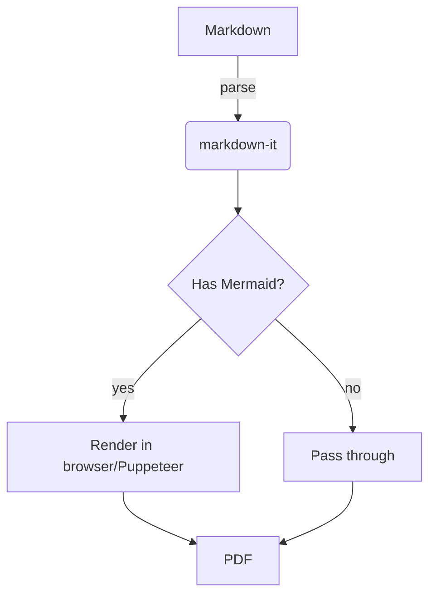
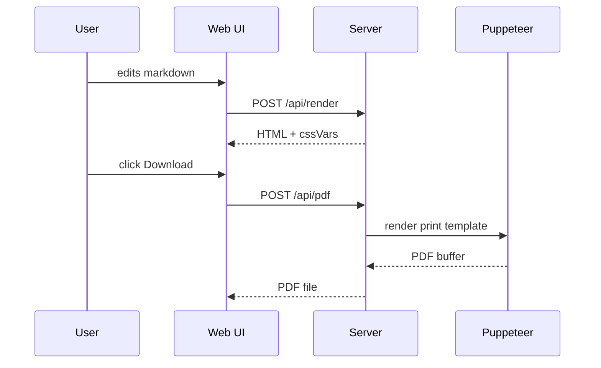
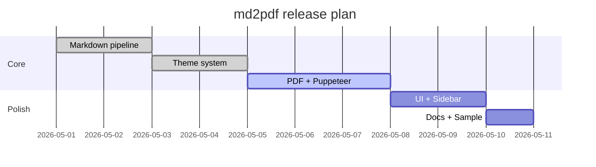
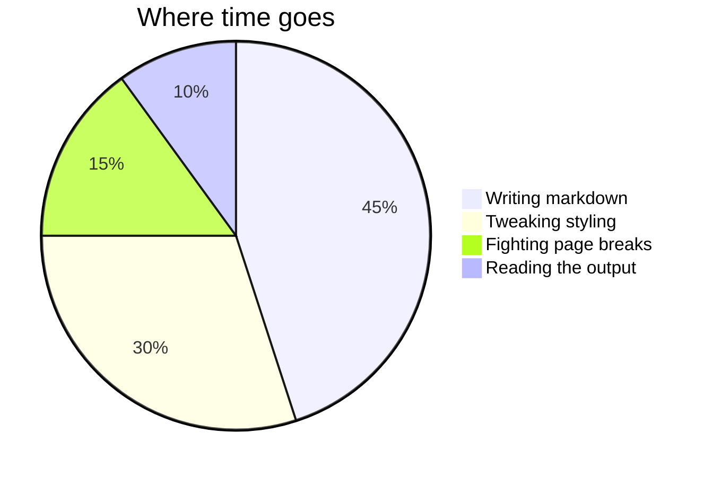

# md2pdf — feature showcase

A sample document exercising every feature md2pdf supports. Drop this into the editor and click **Download PDF** to see it laid out.

## Inline formatting

Regular text, **bold**, *italic*, ***bold italic***, ~~strikethrough~~, and `inline code`. ==Highlighted== too, plus H~2~O and E = mc^2^.

A wikilink: [[Some Note]] — and a piped one: [[Some Note|aliased label]].

%% This comment block won't appear in the rendered output. %%

## Lists

- One
- Two
  - Two-A
  - Two-B
- Three

1. First
2. Second
3. Third

### Task list

- [x] Set up Markdown pipeline
- [x] Wire up Puppeteer
- [ ] Ship 1.0

## Math

Inline: $E = mc^2$. And displayed:

$$
\int_{-\infty}^{\infty} e^{-x^2}\,dx = \sqrt{\pi}
$$

$$
\nabla \cdot \mathbf{E} = \frac{\rho}{\varepsilon_0}, \quad
\nabla \times \mathbf{B} = \mu_0 \mathbf{J} + \mu_0 \varepsilon_0 \frac{\partial \mathbf{E}}{\partial t}
$$

## Callouts

> [!note] A friendly note
> Callouts use the Obsidian `> [!type] Title` syntax.

> [!tip] Tip
> Switch themes from the dropdown above the editor.

> [!warning] Careful
> Some Mermaid diagrams need explicit width to render fully.

> [!danger] Don't do this
> Never trust unrendered Markdown from strangers.

> [!quote] Quote
> *"The medium is the message."* — Marshall McLuhan

## Tables

| Theme      | Vibe              | Best for                |
|------------|-------------------|-------------------------|
| academic   | serif, justified  | papers, essays          |
| minimal    | clean sans-serif  | blog posts, memos       |
| technical  | mono headings     | engineering docs        |
| elegant    | book-like         | long-form, manuscripts  |
| github     | familiar          | READMEs, project docs   |

## Code

```typescript
type Theme = "academic" | "minimal" | "technical" | "elegant" | "github";

function pickTheme(content: string): Theme {
  if (content.includes("```mermaid")) return "technical";
  if (content.length > 5000) return "academic";
  return "minimal";
}
```

```python
def fibonacci(n: int) -> int:
    a, b = 0, 1
    for _ in range(n):
        a, b = b, a + b
    return a
```

```bash
# Quick start
git clone https://github.com/ManolisDia/md2pdf
cd md2pdf
npm install
npm start
```

## Mermaid

### Flowchart



### Sequence



### Gantt



### Pie



## Footnotes

Markdown supports footnotes too[^1] — and they collect at the bottom of the page[^math].

[^1]: This is the first footnote.
[^math]: With formatting like *italics* and even **math**: $\alpha + \beta = \gamma$.

---

That's the showcase. Try editing the YAML on the right to recolor or resize the document live.
